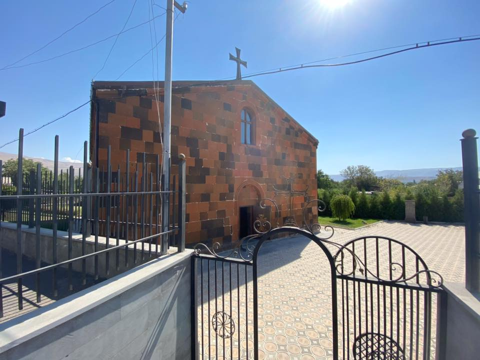
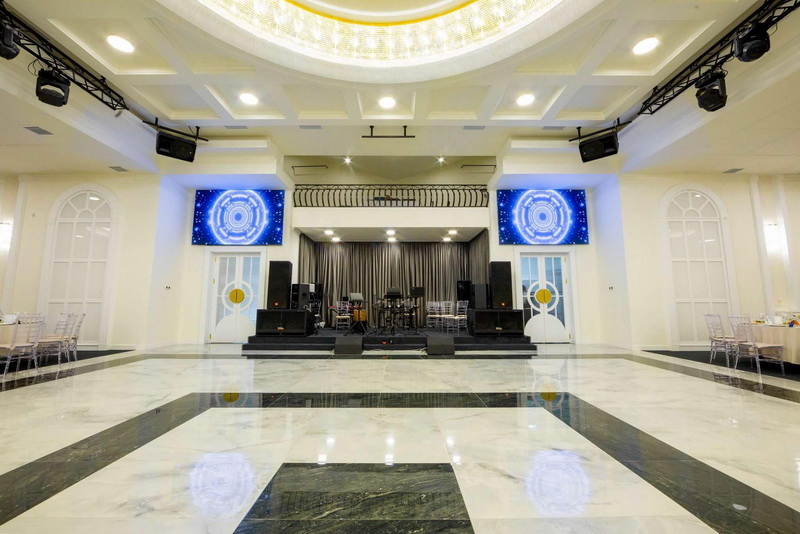

<html lang="hy">
<head>
<meta charset="UTF-8">
<meta name="viewport" content="width=device-width, initial-scale=1.0">
<title>Դարի Հրավիրյալ</title>
<link href="https://fonts.googleapis.com/css2?family=Great+Vibes&family=Montserrat:wght@400;700&display=swap" rel="stylesheet">

</head>
<body>

<!-- Երաժշտություն -->
<audio id="bgMusic" loop>
  <source src="music.mp3" type="audio/mpeg">
</audio>
<button id="musicBtn">🎵</button>

  

    <h1>Վարդան &amp; Սեդա</h1>
    
Սիրով հրավիրում ենք Ձեզ մեր հարսանիքին

    

  

  <!-- 3D Slideshow -->
  

    

  

  <!-- Schedule -->
  

    <h2>Ծրագիր</h2>
    

      <h3>⛪ Եկեղեցի</h3>
      
      
Ժամը՝ 15:00

      <a href="https://maps.app.goo.gl/ktm925BiCbS7feqo7" target="_blank"> Բացել Maps-ում</a>
    

    

      <h3>🍽️ Ռեստորան</h3>
      
      
Ժամը՝ 17:00

      <a href="https://maps.app.goo.gl/MfGsyDTba316jarD7" target="_blank">Բացել Maps-ում</a>
    

  

  <footer>
    Սիրով սպասում ենք քեզ 🌸
  </footer>

</body>
</html>
